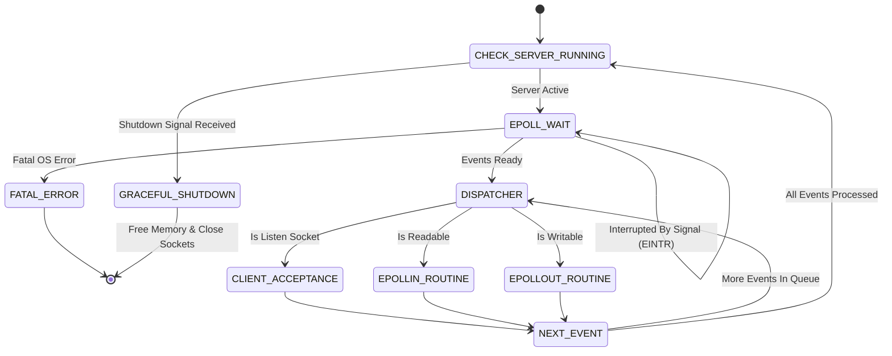
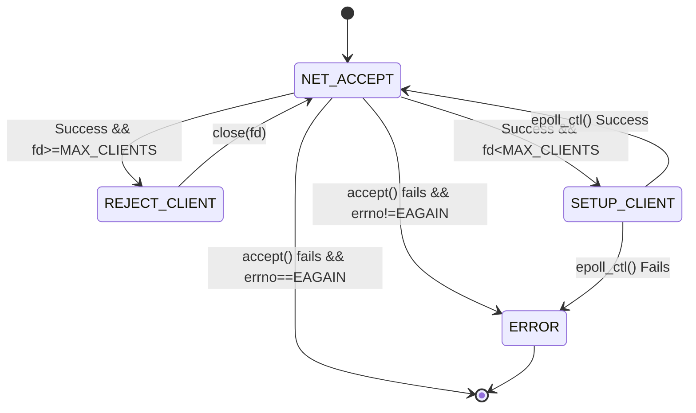
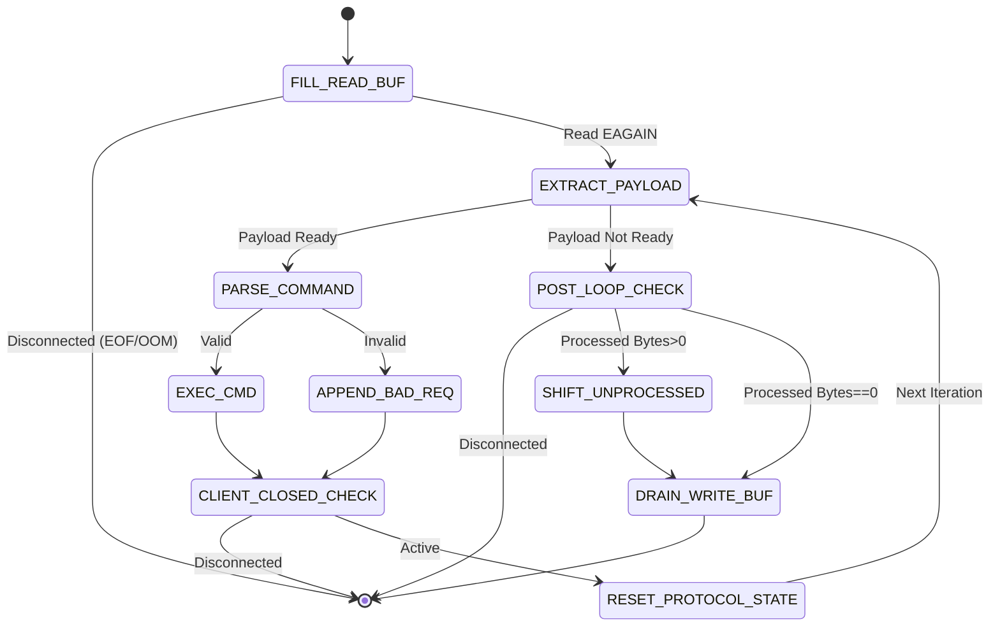
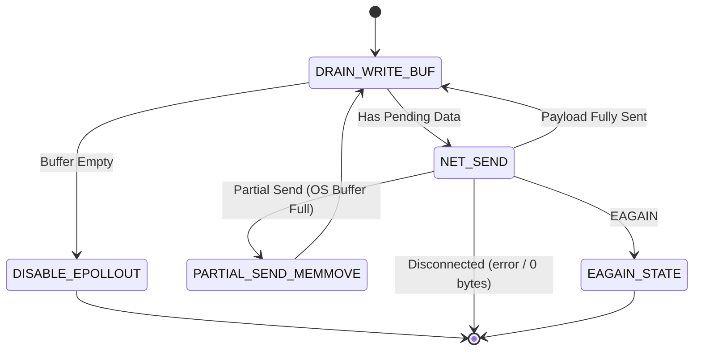
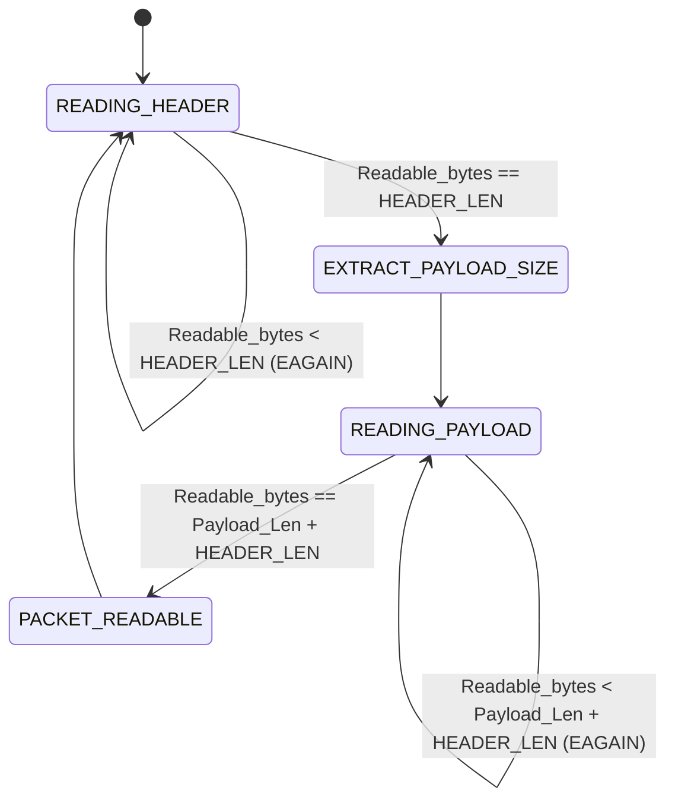

# C-KV: High-Performance Event-Driven Key-Value Store
A high-performance, single-threaded, in-memory Key-Value store written entirely from scratch in C with **zero external dependencies**.

## Table Of Contents
- [Key Features](#key-features)
- [Performance & Benchmarks](#performance--benchmarks)
- [Architecture](#architecture)
  - [Complete Epoll FSM](#complete-epoll-fsm)
  - [Detailed FSMs (Collapsible)](#detailed-routines-fsms)
  - [TCP Fragmentation & Protocol FSM](#tcp-fragmentation-management--protocol-fsm)
  - [Zero-Allocation Parser](#zero-allocation--in-place-parsing)
  - [Storage Engine](#storage-engine--hashing)
  - [Resilience](#resilience--graceful-shutdown)
- [Custom Binary Protocol](#custom-binary-protocol)
- [Known Limitations & Future Improvements](#known-limitations--future-improvements)
- [Build & Run](#build--run)
- [Testing & Benchmarks](#testing--benchmarks)

## Key Features
* **Asynchronous Network I/O**: Built on top of Linux epoll (Edge-Triggered mode) and non-blocking sockets for high-concurrency I/O multiplexing.
* **Custom binary protocol & pipelining**: Implements a strict, length-prefixed binary protocol. The server natively supports request pipelining, batching multiple commands in a single TCP payload to drastically reduce system call overhead.
* **Zero-Allocation / In-Place Parsing**: Commands are decoded in-place directly from the raw TCP read buffers using pointer arithmetic. By operating directly on the network buffers rather than allocating intermediate strings, it heavily minimizes memory allocations and CPU penalties. 
*(Note: This refers to user-space in-place parsing, distinct from kernel-level `sendfile` zero-copy).*
* **Dynamic Storage Engine**: Backed by a custom hash table with separate chaining (djb2 hash) and automatic dynamic rehashing to guarantee **O(1)** average time complexity for `SET`, `GET` and `DEL`.
* **Resilient Memory Management**: Strictly manual memory management with graceful shutdown. Tested against memory-leak (via Valgrind) even under sudden client disconnections or malicious buffer overflow attempts.

## Performance & Benchmarks
Benchmarks were conducted over localhost to isolate the engine's performance from physical network latency. 
The metrics reflect the peak throughput across 3 independent runs (after each run, the server was restarted to clean the hash table state. Indeed, [`run_benchmark.sh`](testing--benchmarks) was used).

### Test environment
* OS: Ubuntu 24.04 LTS 
* CPU: 13th Gen Intel Core i7-1355U - Single-core utilized 
* RAM: 16 GB DDRx
* Concurrency: 10,000 persistent TCP connections
* Payload Size: Dynamically generated per client. Keys average ~8 Bytes, Values average ~3 Bytes.

### Benchmarks docs:
|Mode|Workload / Packet|Operations / Client|Total Ops|Max Throughput|
|:---|:---|:---|:---|:---|
|Pipelining (CRUD)|200 ops batched|200|2,000,000|~3.463M ops/sec|
|Pipelining (SET+GET)|100 ops batched|100|1,000,000|~2.009M ops/sec|
|Ping-Pong (sync)|1 op (wait for ACK)|100|1,000,000|~86k ops/sec|

#### Benchmark Analysis & Scalability
* **Syscall bottleneck vs Pipelining**:
The engine parses and executes commands faster than the OS can handle syscalls (`recv()`, `send()`). Thus, by batching 200 operations per TCP payload, the context-switch overhead is heavily amortized, achieving near-linear (with the batch size) throughput scaling. 
* **Throughput vs Tail Latency**:
The metric in Pipelining mode reflects raw throughput. In Ping-Pong mode, the server hits the physical limits of the network RTT and kernel scheduling, as clients wait for a response before sending the next command. 
* **Future Proofing**: Future benchmark iterations will include Tail Latency metrics (p95, p99) to properly evaluate the system's responsiveness under sustained load.

## Architecture
### Epoll Edge-Triggered & Single-Threaded Event Loop
The core of the server is a **single-thread event loop** based on **epoll** in **Edge-Triggered** mode (`EPOLLET`).
Each file descriptor is configured as **non-blocking** (`O_NONBLOCK`).

#### Complete Epoll FSM



* **CHECK_SERVER_RUNNING**: Evaluates the global shutdown flag to ensure a leak-free teardown of the server upon receiving OS signals (`SIGINT`/`SIGTERM`).
* **EPOLL_WAIT**: Blocks the main thread until new I/O events are ready, gracefully resuming if interrupted by non-fatal signals (`EINTR`).
* **DISPATCHER**: The core event router. It iterates over the ready events and branches the execution to the appropriate sub-routine based on the file descriptor and the event mask.
* **CLIENT_ACCEPTANCE / EPOLLIN / EPOLLOUT**: The three core handlers of the system. Their detailed internal state machines are addressed in the (collapsible) sections below.

#### Detailed Routines FSMs
*(Click to expand the internal state machines for each routine)*

<details>
<summary><b>1. Client Acceptance FSM </b></summary>



* **NET_ACCEPT**: Attempts to accept an incoming connection via `accept()`. If the backlog queue is empty, meaning there is nothing more to accept, the system call returns -1 and `errno` is set to `EAGAIN` or `EWOULDBLOCK`.
* **REJECT_CLIENT**: If the new file descriptor exceeds the `MAX_CLIENTS` threshold, the server drops the connection. 
* **ACCEPT_CLIENT**: The new valid file descriptor is configured as non-blocking, its memory buffers and protocol state are initialized, and it is registered into the epoll interest list with `EPOLLIN | EPOLLET` flags.
* **ERROR**: Fatal error triggered by unrecoverable kernel errors, causing the immediate shutdown of the server.

</details>

<details>
<summary><b>2. EPOLLIN Routine FSM </b></summary>



* **FILL_READ_BUF**: Drain the kernel's receive buffer via `recv()` into the client's isolated read buffer. The buffer is automatically resized if needed, capped at `MAX_BUF_SIZE`. If the limit is exceeded, or if `EOF` (0 bytes received) is detected, the client is immediately disconnected. The loop successfully exits only on `EAGAIN`.
* **EXTRACT_PAYLOAD**: Check the protocol state FSM. If a full packet is present, it computes the exact payload length. If not ready, it breaks the execution loop.
* **PARSE_COMMAND**: The zero-allocation parser. It validates the opcodes and maps directly to the key and (optional) val raw bytes inside the network buffer without executing any malloc.
* **EXEC_CMD / APPEND_BAD_REQ**: The command is either executed against the hash table (appending the result to the client's write buffer) or rejected with a `STATUS_BAD_REQUEST` packet.
* **CLIENT_CLOSED_CHECK**: If the client was flagged as closed during execution, break out the loop to prevent use-after-free.
* **RESET_PROTOCOL_STATE**: Prepare the protocol state machine for the next command (reset to `READING_HEADER`)
* **POST_LOOP_CHECK**: Verify the `closed` flag once the processing loop is over. If the client was closed, abort the remaining operations. 
* **SHIFT_UNPROCESSED**: Execute a single `memmove()` to shift all the unparsed bytes to the beginning of the buffer.
* **DRAIN_WRITE_BUF**: Attempt to flush the client's write buffer back to the network via `send()`. If the kernel network buffer fills up (`EAGAIN`), raise the `EPOLLOUT` flag for this descriptor in the epoll interest list.

</details>

<details>
<summary><b>3. EPOLLOUT Routine FSM </b></summary>



* **DRAIN_WRITE_BUF**: Attempt to flush pending data to the network until the client's write buffer is completely empty.
  
* **NET_SEND**: Invoke the `send()` syscall.
  
* **PARTIAL_SEND_MEMMOVE**: If the kernel accepts only a portion of the payload (the OS network buffer filled up midway), shift the remaining unwritten bytes to the beginning of the buffer. 
  
* **EAGAIN_STATE**: If the kernel network buffer is totally full, `send()` returns -1 and `errno` is set to `EAGAIN`. Due to the fact that for this client the `EPOLLOUT` flag is already raised in the epoll interest list, nothing has to be done.
  
* **DISABLE_EPOLLOUT**: The buffer is totally drained, therefore the `EPOLLOUT` flag is removed (resetting the mask to `EPOLLIN | EPOLLET`) to prevent endless "ready to write" kernel notifications, that would cause CPU-spinning.
  
</details>

**Note**: For the sake of visual clarity, transitions related to unexpected system faults, memory allocation failures or sudden socket disconnections from intermediate states are omitted. Any of these events transitions the FSM directly to a CLEANUP/DISCONNECTION state.

* **Why epoll instead of "Thread-Per-Client" model**:
  The "Thread-Per-Client" model does not scale well. The OS would allocate blocks of memory just for the thread stack (e.g. 8 MB by default on Linux). Thus, when the number of clients increases (e.g. 10k clients referring to the C10K problem), the amount of allocated memory would be in the order of GB just for the thread stacks. In addition, the kernel would be forced to perform thousands of context-switch per seconds, mostly for dormant threads. 
  I/O Multiplexing, with epoll, solves this problem: a single thread that monitors thousands of file descriptors simultaneously, consuming small amount of memory and working only on the sockets that are ready to read or write.

* **Why Edge-Triggered instead of Level-Triggered**:
  In Level-Triggered mode, the kernel keeps waking up the process until there are no more data to read/write, causing a heavy context-switch overhead. Edge-Trigger mode, instead, warns the server just once, that is when the state changes. This approach minimizes the `epoll_wait()` calls and maximizes the operations performed per single wake up.

* **Why Single-Threaded**:
  The implementation of a thread pool would have introduced lock contention (mutex), race conditions and expensive context-switch. Due to the fact that the RAM operations (hash table) are in the order of nanoseconds, the CPU is so fast that the true bottleneck is the network I/O. Therefore, a single thread without locks scales better, as demonstrated by Redis Architecture.


### TCP Fragmentation Management & Protocol FSM
Because TCP is a stream-oriented protocol, data fragmentation is guaranteed under load.
* Each client has independent and isolated read and write heap-allocated buffers.
* The FSM tracks fragmented packets across multiple epoll events.
* Buffers are resized (doubling the capacity) if needed, capped by a `MAX_BUF_SIZE` limit to prevent **OOM** attacks. 

When reading, the read buffer of the client has a state based on the custom protocol, so that it handles TCP fragmentation.

#### Read Buffer Protocol-Based State FSM



* **Why a custom binary length-prefixed protocol**:
Using delimiters (e.g. \n) requires a linear scan for each packet (**O(N)**) and prevents using these special characters in the text to send. Thus, I opted for the implementation of a custom binary protocol that counts the bytes instead of interpreting them, allowing for **O(1)** parsing.

### Zero-Allocation & In-Place Parsing
Each client maintains the read and write heap-allocated buffers isolated. The parser reads and decodes commands acting directly on pointers within the read buffer. In this way, memory allocations happen only in the insertion of nodes into the database (`SET`). The already parsed bytes are shifted with a single `memmove` at the end of the processing loop. 
N.B. The allocation of temporary strings for each command received would have destroyed performance and fragmented the heap.

### Storage Engine & Hashing
The database uses a custom Hash Table implementing separate chaining for collision resolution.
* **Hashing**: djb2 hash function (by Dan Bernstein)
It is a good tradeoff between uniform distribution of short/middle strings and speed (fast bitwise instruction).
* **Dynamic Rehashing**:
When the load factor (#entry / #buckets) reaches 0.75, the table capacity doubles (#buckets).
Rehashing is handled in-place via pointer reassignment. 
* **Complexity**:
Lookups, insertions (and updates) and deletion run in amortized **O(1)** time. 

### Resilience & Graceful Shutdown
Kernel signals (`SIGINT`, `SIGTERM`) are intercepted to gracefully interrupt the event-loop. 
Malformed packets cause the immediate closure of the malicious socket without affecting the server stability.
Sudden and brutal disconnections of clients in the middle of a pipelining are intercepted and gracefully managed.
In any case, the server intercepts the event and every resource is deallocated (and file eventually closed), guaranteeing **zero memory leaks** (verified via Valgrind & ASAN).
The error tolerance also includes a hard limit to the growth of client buffers (`MAX_BUF_SIZE`), thus protecting the system against OOM / buffer overflows / exhaustion of memory.

## Custom Binary Protocol
As explained in the section [TCP Fragmentation Management & Protocol FSM](#tcp-fragmentation-management--protocol-fsm), to avoid scanning for delimiters the K-V Store uses a **custom length-prefixed binary protocol**.

### Endianness
All integer fields in both the headers and the payloads are serialized in Big Endian, which is the standard Network Byte Order, using `htonl/htons` and `ntohl/ntohs`. This ensures safe cross-architecture communication (e.g. ARM clients communicating with an x86_64 server).

### Request Packet Structure
Every client request must be structured as a **4-byte header**, indicating the payload size, followed by the **binary payload**.

1. **Overall Packet**
```text
+-----------------------------+------------------------------+

| Header (4 bytes)            | Payload (PAYLOAD_SIZE bytes) |
+-----------------------------+------------------------------+

| PAYLOAD_SIZE                | BINARY PAYLOAD               |
| (uint32_t)                  | (Structured Command)         | 
+-----------------------------+------------------------------+
```
2. **Payload Internal Structure**
```text
+----------------+-------------------+---------------+-------------------+---------------+

| CMD (1 byte)   | KEY_LEN (2 bytes) | KEY (K bytes) | VAL_LEN (2 bytes) | VAL (V bytes) | 
+----------------+-------------------+---------------+-------------------+---------------+

| (Command type) | K                 | Key           | V                 | Val           |
| (uint8_t)      | (uint16_t)        | (Raw bytes)   | (uint16_t)        | (Raw bytes)   |
+----------------+-------------------+---------------+-------------------+---------------+
```
**Note**: For `GET` and `DEL` commands, the `VAL_LEN` and `VAL` fields are omitted.

3. **Commands Opcodes** (`CMD`)
* `0x00` : `CMD_SET`
* `0x01` : `CMD_GET`
* `0x02` : `CMD_DEL`

### Response Packet Structure
The server replies with a similar **4-byte header**, indicating the payload size, followed by the **binary payload**, which is composed of:
* 1-byte Status Code
* (optional) Retrieved Data: for a successful `GET` request, the requested data is appended. 
```text
+------------------+----------------------+--------------------------+

| Header (4 bytes) | Status Code (1 byte) | Response Data (optional) | 
+------------------+----------------------+--------------------------+

| PAYLOAD_SIZE     | Status Code          | Response Data            |
| (uint32_t)       | (uint8_t)            | (Raw bytes)              |
+------------------+----------------------+--------------------------+
```

**Status Codes**:

* `0x00` : `STATUS_SUCCESS`
* `0x01` : `STATUS_ERROR`
* `0x02` : `STATUS_NOT_FOUND`
* `0x03` : `STATUS_BAD_REQUEST`

## Known Limitations & Future Improvements
1. **Stop-the-world Rehashing**: Currently, when the hash table exceeds the 0.75 load factor, the rehashing process is blocking. While extremely fast for thousands of keys, scaling to tens of millions of keys could introduce a latency spike (freezing the event loop) during the pointer reassignment phase. 
This could be mitigated by implementing **Incremental Rehashing**, shifting buckets gradually during standard CRUD operations.

2. **Lack of Persistence**: The system, at the moment, is purely in-memory. A server crash results in total data loss. 
This issue can be solved by implementing an asynchronous **AOF** persistence layer.

3. **Single-Core Utilization**: Being strictly single-threaded, a single instance of the engine cannot natively utilize multi-core CPUs.
Possible mitigation: instead of introducing locks (which would destroy latency), the system can be designed to scale via **Multi-Process Sharding**. This will support running multiple independent instances on different ports (e.g. 8000 to 8007) and routing traffic via a client-side hash partitioner.

4. **Memory Fragmentation**: Frequent client connections and dynamic string allocations (during `SET`) can lead to heap fragmentation over long uptimes.
A solid workaround could be to implement a custom **Memory Arena / Pool** allocator to serve fixed-size blocks.

5. **Feature Completeness**: The current API is limited to basic CRUD operations.
Other features, like **TTL** with an expiration mechanism, could be implemented.

6. **Buffer Shifting Overhead**: The EPOLLIN routine uses memmove to shift unparsed bytes when dealing with fragmented TCP packets.
A transition from linear buffers to **circular buffers** to eliminate memory shifting can be realized.

## Build & Run
### Prerequisites
* Linux OS (required for epoll)
* C Compiler (`gcc` or `clang`)
* Make
* Python 3 (required for testing edge cases)
* Go (required for load generation and benchmarking)
* Valgrind

### Build Options
The project uses a standard Makefile.

```bash
# Build the highly optimized release version (-O3, default)
make release

# Build for development (disables optimizations, adds -g debug symbols)
make debug

# Build with AddressSanitizer 
make asan

# Running the server
./kvstore
```

By default, the server binds to 127.0.0.1:8080. Connection limits and buffer sizes (`MAX_BUF_SIZE` = 32KB) can be tuned directly inside `config.h` before compiling.


## Testing & Benchmarks
**Important Note on File Descriptors**: The benchmarking suite aims to open 10.000 concurrent TCP connections. Before running the benchmarks with a high `MAX_CLIENTS` configuration, ensure your OS file descriptor limit is appropriately scaled. 
To temporarily raise the limit in your terminal, run:
```bash
ulimit -n 65535
```

The testing architecture is split into two distinct domains: Functional Reliability and Performance.

1. **Functional Edge Cases** (Python)
The `test/test_edge_cases.py` script acts as a malicious client. It intentionally sends malformed binary packets, fragmented headers and triggers abrupt TCP disconnections. 
This suite should be run while the server is wrapped in Valgrind, to prove the resilience of the memory manager and the absence of memory leaks during client failures. 

```bash
# Start the server with Valgrind in terminal 1:
valgrind --leak-check=full ./kvstore

# Run the edge-cases test in terminal 2:
python3 test/test_edge_cases.py
```

2. **Benchmarking** (Go)
To ensure a clean state of the hash table, the server must be restarted between each benchmark.
This shell script fully automates the compile-run-test-teardown cycle.

```bash
# Grants execution permissions to the script
chmod +x run_benchmarks.sh

# Automatically runs the full suite (CRUD, Pipelining, Ping-Pong) against clean server
./run_benchmarks.sh
```
**Note** on Custom Configurations: The Go and Python test suites are strictly calibrated against the default `config.h` parameters (Port 8080, `MAX_BUF_SIZE` 32KB). If you modify the server's listening port or significantly reduce the buffer size, ensure you update the corresponding constants in the test scripts to prevent connection refusals or payload fragmentation failures.
